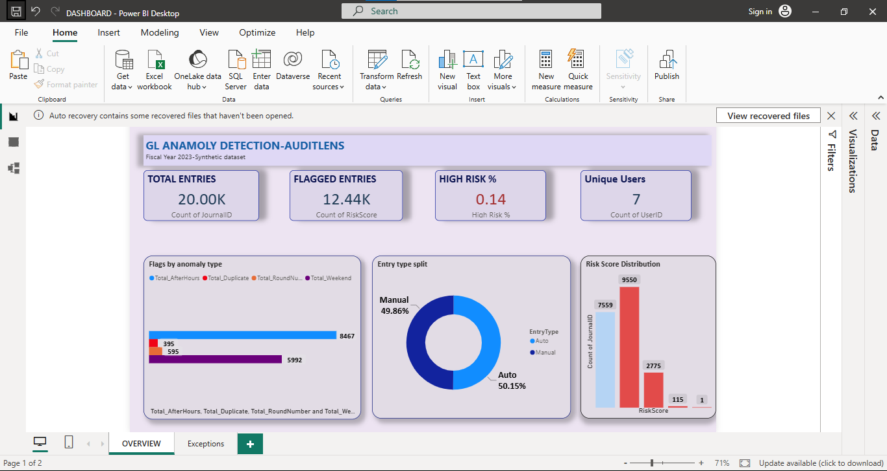
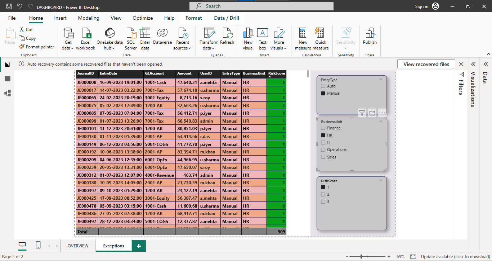

# AuditLens — GL Transaction Anomaly Detection
A Power BI dashboard that flags high-risk journal entries
in General Ledger data using audit testing (CAATs) logic.

## Business Problem
Audit teams must review thousands of journal entries for
high-risk patterns. Manual testing is slow and inconsistent.
This project automates the detection of suspicious GL entries
across business units, users, and time periods — reducing
review time and surfacing the highest-priority exceptions first.

## Data
Synthetic GL dataset (20,000 entries) generated in Python,
with deliberately injected anomalies:

| Anomaly Type | Rows Injected |
|---|---|
| Round-number amounts | 300 |
| Weekend postings | 200 |
| After-hours entries | 250 |
| Duplicate Journal IDs | 100 |

Multi-currency (CAD / USD / INR), realistic GL accounts
(Cash, AR, AP, Revenue, COGS, OpEx, Tax, Equity),
7 distinct users, 5 business units, 50/50 manual/auto split.

## Approach
1. **Data generation** — Python (pandas + numpy) with a fixed
   random seed to ensure reproducibility; anomalies injected
   programmatically before export to CSV
2. **Data prep** — Excel: column mapping, date parsing,
   duplicate-ID resolution, removal of junk rows
3. **Flag logic** — Four binary risk flags computed per entry:
   - `Flag_RoundNumber` — Amount divisible by 1,000
   - `Flag_Weekend` — EntryDate falls on Saturday or Sunday
   - `Flag_AfterHours` — Posting hour outside 06:00–19:59
   - `Flag_Duplicate` — JournalID appears more than once
4. **Risk scoring** — `RiskScore` = sum of the four flags (0–4);
   entries with score ≥ 3 treated as high-priority
5. **Power BI dashboard** — two-page report: Overview KPIs +
   drill-through Exceptions table with slicer filters

## Key Findings
- **12,441 of 20,000 entries** carry at least one risk flag (62%)
- **After-hours entries** are the most common anomaly (8,467 flagged)
- **116 entries** scored 3 or higher — highest-priority for review
- **High Risk %** across the full dataset: 0.14 (14 per 1,000 entries)
- 7 unique users identified; `admin` account appears in flagged entries
  across multiple business units

## Tools
Power BI · DAX · Excel · Python (pandas, numpy)

## Dashboard

[📄 View Full Dashboard (PDF)](public/AuditLens.pdf)